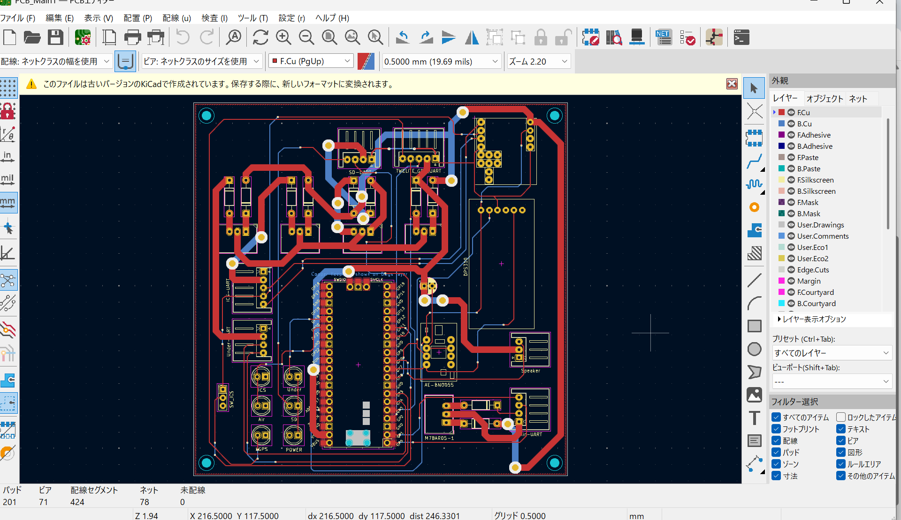

# 鳥人間サークル 搭載基板

## 概要
鳥人間サークルの飛行機に搭載する基板をKiCadで設計しました。

## 機能
- 左右翼・尾翼のサーボモーター制御
- 超音波センサによる飛行高度の計測
- 風圧・風向きセンサによるデータ取得

## 使用部品
- マイコン：Raspberry Pi
- センサー：超音波センサ、風圧・風向きセンサ

## 動作確認
- 電源投入時にLED点灯を確認
- 各センサの正常動作を確認
